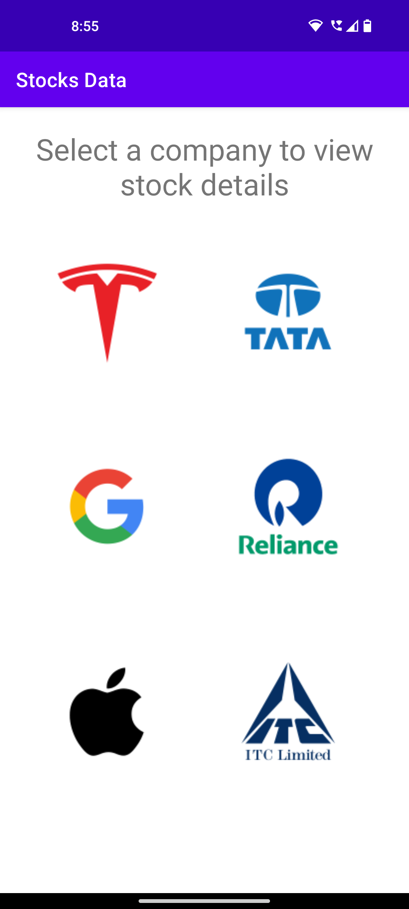

# Simple-Stock-Market-App
Basic stock market application developed using Android Studio which provides stock details of a few companies.

## App Interface
The components in the View are laid using absolute layout. 
It has two views, the first of which displays a number of stocks with clickable logos. 
The data for the chosen stock are displayed on the second screen. 
Making an API call to the Alpha Vantage stock API allows the application to show the data.

## API Used
Alpha Vantage provides enterprise-grade financial market data through a set of powerful and developer-friendly data APIs and spreadsheets. 
Alpha Vantage is a one-stop-shop for real-time and historical global market data delivered through REST stock APIs, Excel and Google Sheets.
[https://www.alphavantage.co/]

## Libraries Used
The Volley library is used as a dependency for making network requests. 
Volley is an HTTP library that makes networking for Android apps easier and most importantly faster.
[https://google.github.io/volley/]

